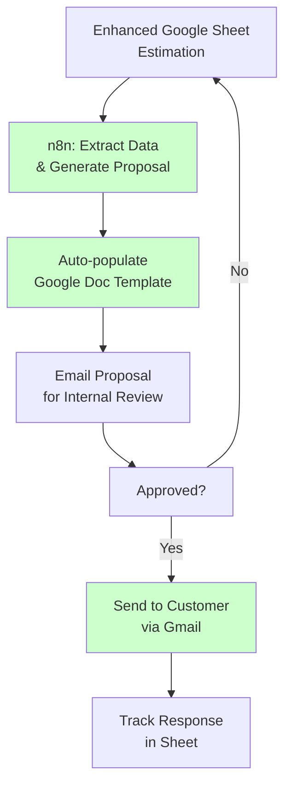
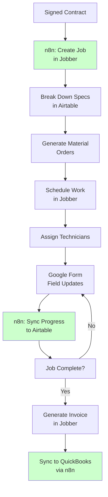

# HVAC Minimal Cost Solution - Budget-Conscious Implementation

## Cost Comparison Analysis

### ServiceTitan vs Minimal Setup
- **ServiceTitan**: $1,500/month = $18,000/year
- **Proposed Minimal Setup**: ~$200/month = $2,400/year
- **Annual Savings**: $15,600 (87% cost reduction)

## Proposed Minimal Tech Stack

### Core Components & Costs
1. **n8n Cloud**: $20/month (starter plan)
2. **AI/Automation Usage**: $20-30/month (OpenAI API, document processing)
3. **Jobber Connect**: $110/month (team scheduling & field management)
4. **Airtable**: $20/month (5 users, Pro plan)
5. **Google Workspace**: $30/month (5 users for forms, drive, sheets)
6. **Management Fee**: $100/month (system maintenance & support)

**Total Monthly Cost**: ~$300/month
**Total Annual Cost**: ~$3,600/year

### Implementation Fees
- **Pre-Sales Setup**: $1,500 (estimation automation, proposal generation)
- **Scheduling Setup**: $3,000 (job management, invoicing integration)
- **Total Setup**: $4,500

## Minimal Viable Product (MVP) Architecture

### Phase 1: Pre-Sales Automation ($1,500 setup)

#### Tools Used:
- **Google Sheets**: Enhanced estimation spreadsheet with formulas
- **n8n**: Automation workflows
- **Google Docs**: Proposal templates
- **Gmail**: Automated sending

#### Workflow:


### Phase 2: Scheduling & Job Management ($3,000 setup)

#### Tools Used:
- **Jobber**: Scheduling, customer management, basic invoicing
- **Airtable**: Project tracking and material management
- **Google Forms**: Field worker updates
- **n8n**: Integration between systems
- **QuickBooks Simple Start**: $15/month for basic accounting

#### Workflow:


## Detailed Component Breakdown

### Google Sheets Enhancement (Pre-Sales)
- **Smart Templates**: Pre-built formulas for common calculations
- **Data Validation**: Dropdown menus for parts and labor rates
- **Conditional Formatting**: Visual indicators for pricing tiers
- **Auto-calculations**: Overhead, taxes, profit margins
- **Export Ready**: Structured data for n8n processing

### n8n Automation Workflows
1. **Estimation to Proposal**: Extract sheet data → populate document template
2. **Email Automation**: Send proposals and follow-ups
3. **Jobber Integration**: Create jobs from signed contracts
4. **Progress Sync**: Update Airtable from Google Forms
5. **QuickBooks Sync**: Financial data integration

### Jobber Utilization
- **Customer Management**: Contact info and service history
- **Scheduling**: Technician calendars and job assignments
- **Basic Invoicing**: Generate and send invoices
- **Mobile App**: Technician field access (included)
- **Payment Processing**: Optional add-on if needed

### Airtable Project Tracking
- **Material Management**: Parts lists and vendor info
- **Project Status**: Real-time progress tracking
- **Document Storage**: Photos and completion certificates
- **Change Orders**: Additional work tracking
- **Reporting**: Basic analytics and KPIs

### Google Forms Field Updates
- **Job Start/End Times**: Simple time tracking
- **Progress Photos**: Upload directly to Google Drive
- **Material Usage**: Track parts consumed
- **Issues/Notes**: Field observations and problems
- **Customer Signatures**: Digital sign-off on completion

## Implementation Strategy

### Phase 1 Implementation (Weeks 1-3)
1. **Week 1**: Enhanced Google Sheets setup with smart formulas
2. **Week 2**: n8n workflows for proposal generation
3. **Week 3**: Email automation and testing

### Phase 2 Implementation (Weeks 4-8)
1. **Week 4**: Jobber setup and configuration
2. **Week 5**: Airtable project tracking structure
3. **Week 6**: Google Forms for field updates
4. **Week 7**: n8n integration workflows
5. **Week 8**: QuickBooks sync and testing

## Cost-Benefit Analysis

### Monthly Operational Costs
```
n8n Cloud:              $20
AI/Automation:          $25
Jobber Connect:         $110
Airtable Pro:           $20
Google Workspace:       $30
QuickBooks Simple:      $15
Management Support:     $100
------------------------
Total Monthly:          $320
```

### Annual ROI Calculation
- **Setup Investment**: $4,500
- **Annual Operating**: $3,840
- **Total Year 1**: $8,340
- **ServiceTitan Year 1**: $18,000
- **Net Savings Year 1**: $9,660
- **ROI**: 116% return on investment

### Efficiency Gains (Conservative Estimates)
- **Proposal Generation**: 2 hours → 30 minutes (75% reduction)
- **Job Setup**: 1 hour → 15 minutes (75% reduction)
- **Progress Tracking**: Manual → Automated (100% time savings)
- **Invoice Generation**: 30 minutes → 5 minutes (83% reduction)

## Scalability Path

### Year 1: Foundation
- Establish core workflows
- Train team on new processes
- Measure efficiency gains
- Refine automation rules

### Year 2: Enhancement
- Add more sophisticated reporting
- Implement predictive scheduling
- Enhance customer communication
- Consider mobile app upgrades

### Year 3: Advanced Features
- AI-powered estimation
- IoT equipment monitoring
- Advanced analytics
- Potential platform migration if growth justifies

## Risk Mitigation

### Technical Risks
- **Backup Systems**: Keep spreadsheets as fallback
- **Data Export**: Ensure all platforms allow data export
- **Integration Testing**: Thorough testing before go-live
- **User Training**: Comprehensive staff education

### Business Risks
- **Gradual Rollout**: Implement one phase at a time
- **Parallel Operations**: Run old system alongside new initially
- **Regular Reviews**: Monthly check-ins to address issues
- **Flexibility**: Ability to adjust workflows based on feedback

## Success Metrics

### Immediate (3 months)
- 50% reduction in proposal generation time
- 100% of jobs tracked in system
- 90% reduction in duplicate data entry
- Customer satisfaction maintained or improved

### Medium-term (6-12 months)
- 25% increase in job completion efficiency
- 95% invoice accuracy
- Real-time project visibility for all stakeholders
- Positive ROI achievement

This minimal approach gives them 80% of ServiceTitan's benefits at 20% of the cost, with a clear path to scale up as their business grows.