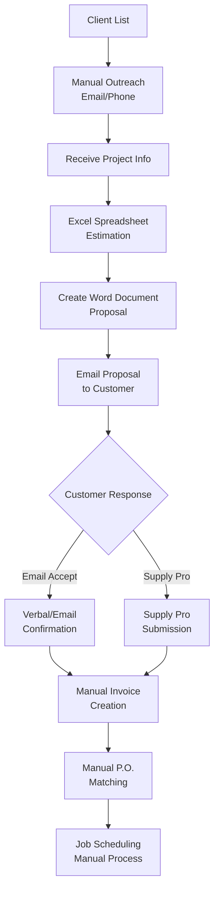

# HVAC Business Current Operations Analysis

## Business Overview
- **Location**: Charlotte, NC area
- **Client Acquisition**: Primarily word-of-mouth referrals
- **Client Base**: Established list of repeat customers
- **Contact Methods**: Email and phone outreach
- **Pipeline Status**: Currently healthy, potential for future expansion

## Current Pre-Sales Process

### 1. Lead Generation & Client Contact
- Maintain client list manually
- Reach out via email/phone for new opportunities
- Rely on existing relationships and referrals

### 2. Estimation Process
- **Tool**: Multi-sheet Excel spreadsheet
- **Components**:
  - Parts pricing
  - Labor costs
  - Materials costs
  - Overhead calculations
- **Output**: Summary sheet with equipment and installation breakdown
- **Timeline**: Not formally documented, created ad-hoc for proposals

### 3. Proposal Creation
- **Tool**: Word document template
- **Content**:
  - Detailed work scope
  - Final cost breakdown
  - Timeline (informal)
- **Delivery**: Email to customer

### 4. Contract Confirmation
- **Current Methods**:
  - Email acceptance
  - Verbal confirmation
  - Occasional use of Supply Pro for contract submission
- **Issues**:
  - No formal contract signing process
  - Manual invoice generation
  - Inconsistent P.O. matching process

## Pain Points Identified

1. **Manual Estimation**: Time-intensive spreadsheet calculations
2. **Inconsistent Documentation**: Timeline and scope not standardized
3. **Informal Contracting**: No digital signature process
4. **Disconnected Systems**: Estimation, proposal, and contracting are separate processes
5. **Manual Follow-up**: No automated reminders or progress tracking
6. **Invoice Management**: Manual creation and P.O. matching

## Current Workflow Diagram

## Next Steps
This analysis will be used to design a streamlined digital workflow that addresses the identified pain points while maintaining the personal touch that drives their word-of-mouth success.