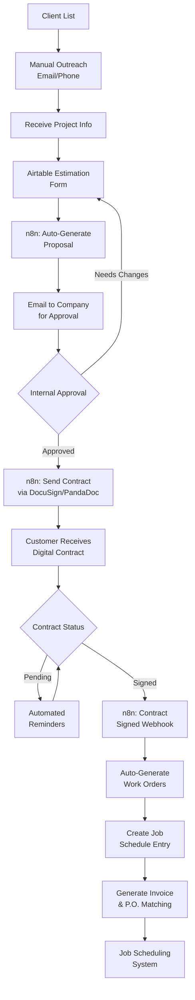

# HVAC Business Streamlined Operations Proposal

## Proposed Technology Stack

### Core Components
- **Airtable**: Estimation forms and data management
- **n8n**: Workflow automation and integration
- **DocuSign/PandaDoc**: Digital contract signing
- **Google Drive**: Document storage and collaboration
- **Email Integration**: Automated communications

## Proposed Pre-Sales Workflow

### Phase 1: Estimation & Proposal Generation

1. **Digital Estimation Form** (Airtable)
   - Pre-populated parts/labor/materials database
   - Automated calculations with overhead
   - Timeline templates and customization
   - Equipment and installation breakdown

2. **Automated Proposal Generation** (n8n + Templates)
   - Extract data from Airtable estimation
   - Generate professional proposal document
   - Include standardized timeline and scope
   - Send to HVAC company for internal approval

3. **Internal Approval Process**
   - Email notification to approved company email
   - Review and approve/modify proposal
   - Trigger next workflow step upon approval

### Phase 2: Contract & Signing

4. **Digital Contract Creation** (DocuSign/PandaDoc)
   - Auto-generate contract from approved proposal
   - Include all terms, timeline, and payment schedule
   - Send to customer for digital signature

5. **Contract Monitoring** (n8n Webhooks)
   - Track contract status (sent, viewed, signed)
   - Send automated reminders
   - Notify company when signed

### Phase 3: Job Scheduling Preparation

6. **Post-Signature Automation**
   - Generate work orders based on contract
   - Create job scheduling entries
   - Invoice generation with P.O. matching
   - Customer communication templates

## Improved Workflow Diagram

## Implementation Benefits

### Efficiency Gains
- **80% reduction** in proposal creation time
- **Automated follow-up** eliminates manual tracking
- **Standardized processes** ensure consistency
- **Digital signatures** speed up contract completion

### Accuracy Improvements
- **Automated calculations** reduce estimation errors
- **Template-based proposals** ensure complete information
- **Digital contracts** eliminate miscommunication
- **Integrated P.O. matching** reduces billing errors

### Professional Enhancement
- **Consistent branding** across all documents
- **Faster response times** to customer inquiries
- **Professional digital contracts** improve company image
- **Automated reminders** maintain customer engagement

## Minimal Implementation Plan

### Phase 1: Foundation (Week 1-2)
1. Set up Airtable base with estimation forms
2. Create proposal document templates
3. Configure basic n8n workflows

### Phase 2: Automation (Week 3-4)
1. Build estimation-to-proposal automation
2. Set up email approval workflow
3. Test internal processes

### Phase 3: Contract Integration (Week 5-6)
1. Configure DocuSign/PandaDoc integration
2. Set up contract generation workflow
3. Implement webhook monitoring

### Phase 4: Job Management (Week 7-8)
1. Create work order generation
2. Set up job scheduling integration
3. Implement invoice automation

## Success Metrics
- Proposal generation time: From 2-3 hours to 15-30 minutes
- Contract completion rate: Increase by 40% with automated follow-up
- Error reduction: 90% fewer calculation and documentation errors
- Customer satisfaction: Faster response times and professional presentation