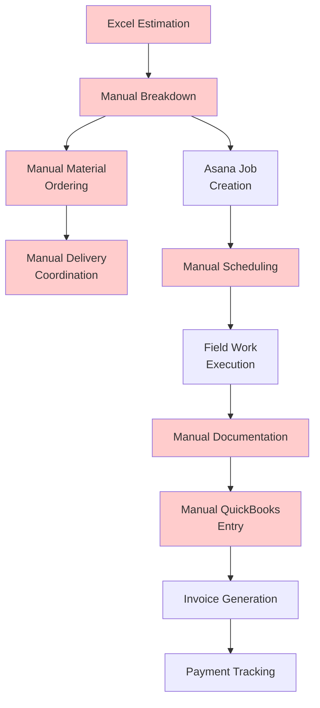
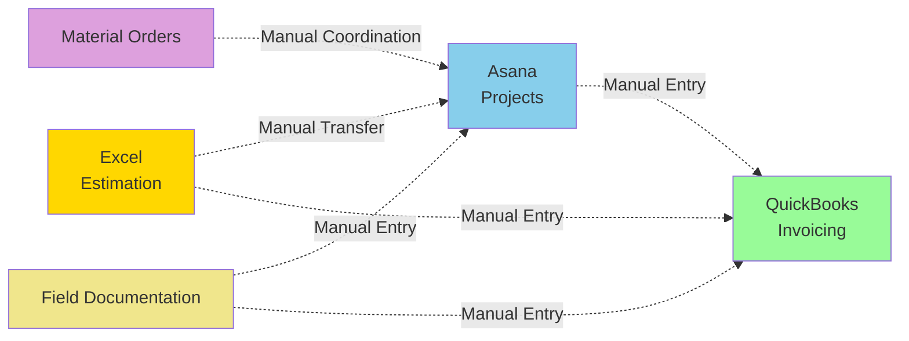

# HVAC Scheduling & Job Management - Current State Analysis

## Current Systems in Use
- **Excel Spreadsheet**: Initial estimation and specs
- **Asana**: Job tracking and project management
- **QuickBooks**: Financial management and invoicing
- **Manual Processes**: Material ordering, delivery coordination, scheduling

## Current Post-Contract Workflow

### 1. Proposal Breakdown (Manual Process)
- **Input**: Signed contract/proposal
- **Process**: Manual review and breakdown of specifications
- **Output**: Material lists, labor requirements, timeline estimates
- **Pain Point**: No systematic way to break down specs into actionable items

### 2. Material Management (Disconnected)
- **Ordering**: Manual process based on breakdown
- **Inventory**: No centralized tracking system
- **Delivery**: Coordination done via phone/email
- **Issues**: No visibility into material status or delivery schedules

### 3. Job Scheduling (Asana + Manual)
- **Tool**: Asana for some tracking
- **Types**: 
  - Single-day jobs
  - Multi-day projects
  - Additional work (change orders)
- **Assignment**: Project manager schedules work
- **Pain Points**: 
  - Not tied back to original proposal
  - Limited visibility for engineers
  - No integrated timeline management

### 4. Work Execution & Documentation
- **Field Work**: Engineers perform installations
- **Documentation**: Manual notes, photos (disconnected)
- **Updates**: Limited real-time visibility
- **Change Orders**: Informal process for additional work

### 5. Project Completion & Invoicing
- **Completion**: Manual verification
- **Invoice Generation**: Manual entry in QuickBooks
- **Payment Tracking**: QuickBooks only
- **Data Sync**: Manual re-entry across systems

## Current Data Flow Issues

## Pain Points Identified

### Data Duplication
1. **Triple Entry**: Same information entered in Excel → Asana → QuickBooks
2. **Version Control**: No single source of truth for project details
3. **Sync Issues**: Changes in one system don't reflect in others

### Visibility Problems
1. **Material Status**: No real-time inventory or delivery tracking
2. **Job Progress**: Limited visibility between project manager and field engineers
3. **Financial Tracking**: Disconnect between job costs and billing

### Process Inefficiencies
1. **Manual Breakdown**: Specs not systematically converted to work orders
2. **Change Order Management**: No formal process for additional work
3. **Documentation**: Field notes and photos not centralized
4. **Timeline Management**: No integrated scheduling across materials and labor

### Integration Gaps
1. **Proposal Disconnect**: Original proposal not linked to execution
2. **Material-Job Sync**: Ordering and scheduling not coordinated
3. **Financial Integration**: Manual QuickBooks entry creates delays and errors

## Current System Relationships

## Requirements for Improved System

### Core Needs
1. **Single Data Entry**: Information entered once, used everywhere
2. **Proposal Traceability**: All work tied back to original contract
3. **Real-time Visibility**: Project managers and engineers see current status
4. **Automated Sync**: QuickBooks integration eliminates manual entry
5. **Change Order Management**: Formal process for additional work
6. **Material Integration**: Ordering and delivery tied to job schedules

### Integration Requirements
1. **Airtable → Asana**: Project creation and updates
2. **Asana → QuickBooks**: Automated financial sync
3. **Material Management**: Inventory and delivery tracking
4. **Mobile Access**: Field engineers can update job status
5. **Document Management**: Centralized photos and documentation

## Success Metrics
- **Data Entry Reduction**: 70% fewer manual entries
- **Project Visibility**: Real-time status for all stakeholders
- **Invoice Accuracy**: 95% reduction in billing errors
- **Timeline Adherence**: Better coordination between materials and labor
- **Change Order Processing**: Formal workflow reduces disputes