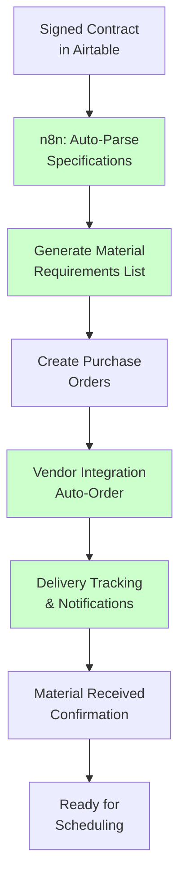
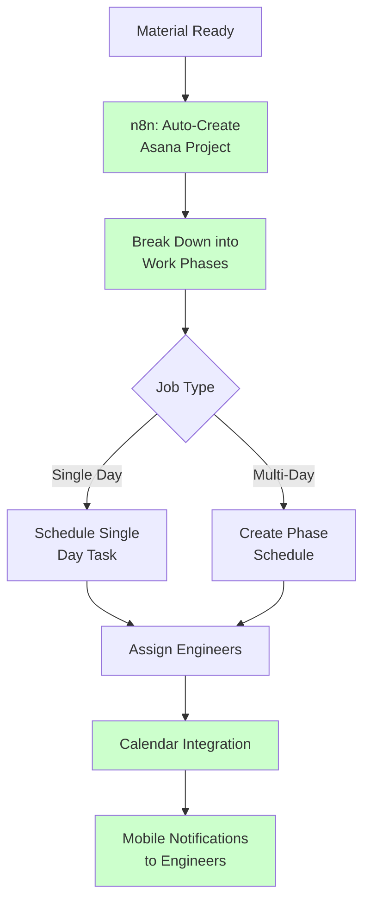
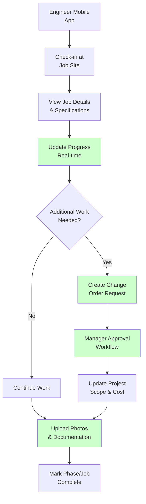
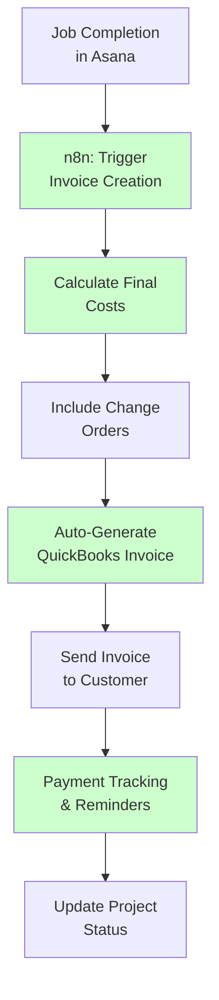

# HVAC Scheduling & Job Management - Proposed Integrated Solution

## Integrated Technology Stack

### Core Platform Integration
- **Airtable**: Central data hub (proposals, specs, materials, schedules)
- **n8n**: Workflow automation and system integration
- **Asana**: Enhanced project management with automated data sync
- **QuickBooks**: Automated financial integration
- **Mobile App/Forms**: Field engineer documentation and updates

### New Components
- **Material Management Module**: Inventory and delivery tracking
- **Change Order System**: Formal additional work management
- **Document Management**: Centralized file and photo storage
- **Real-time Dashboard**: Project visibility for all stakeholders

## Proposed Integrated Workflow

### Phase 1: Automated Spec Breakdown & Material Management



### Phase 2: Intelligent Job Scheduling



### Phase 3: Field Execution & Documentation



### Phase 4: Automated Invoicing & Financial Sync



## Detailed System Architecture

### Central Data Model (Airtable)

#### Projects Table
- **Project ID**: Unique identifier linking all systems
- **Original Proposal**: Reference to signed contract
- **Specifications**: Parsed and structured specs
- **Material Requirements**: Auto-generated from specs
- **Timeline**: Planned vs actual dates
- **Status**: Real-time project status
- **Total Cost**: Including change orders

#### Materials Table
- **Item Details**: Parts, quantities, specifications
- **Vendor Information**: Supplier and pricing
- **Order Status**: Ordered, shipped, delivered, used
- **Project Assignment**: Which job needs which materials
- **Delivery Schedule**: Coordinated with job timeline

#### Work Orders Table
- **Phase Breakdown**: Single/multi-day job components
- **Engineer Assignment**: Who's doing what work
- **Dependencies**: Material and predecessor requirements
- **Progress Tracking**: Real-time completion status
- **Documentation**: Photos, notes, completion certificates

#### Change Orders Table
- **Original Scope**: Reference to base project
- **Additional Work**: Description and justification
- **Cost Impact**: Labor and material additions
- **Approval Status**: Manager approval workflow
- **Customer Approval**: Formal change order acceptance

### Integration Workflows (n8n)

#### 1. Contract-to-Project Automation
```
Signed Contract → Parse Specifications → Generate Material List → 
Create Purchase Orders → Setup Asana Project → Schedule Initial Timeline
```

#### 2. Material-Schedule Coordination
```
Material Delivery Confirmed → Update Project Timeline → 
Notify Project Manager → Reschedule if Needed → Alert Engineers
```

#### 3. Change Order Management
```
Engineer Requests Change → Manager Review → Cost Calculation → 
Customer Approval → Update Project Scope → Adjust Timeline & Budget
```

#### 4. Completion-to-Invoice Automation
```
Job Marked Complete → Validate All Phases → Calculate Final Costs → 
Generate QuickBooks Invoice → Send to Customer → Track Payment
```

### Mobile Field Application Features

#### Engineer Dashboard
- **Daily Schedule**: Assigned jobs and locations
- **Job Details**: Specifications, materials, timeline
- **Progress Updates**: Real-time status reporting
- **Photo Documentation**: Before/during/after photos
- **Change Order Requests**: Formal additional work process
- **Material Verification**: Confirm delivery and usage

#### Project Manager Dashboard
- **Project Overview**: All active jobs and status
- **Resource Management**: Engineer schedules and availability
- **Material Tracking**: Delivery status and inventory
- **Change Order Approvals**: Review and approve additional work
- **Financial Dashboard**: Costs, budgets, and profitability

## Implementation Benefits

### Elimination of Duplicate Entry
- **Single Source**: All data originates in Airtable
- **Automated Sync**: n8n pushes data to Asana and QuickBooks
- **Real-time Updates**: Changes propagate automatically
- **Reduced Errors**: No manual re-entry means fewer mistakes

### Enhanced Visibility
- **Project Traceability**: Every task tied back to original proposal
- **Real-time Status**: All stakeholders see current progress
- **Material Coordination**: Delivery and scheduling synchronized
- **Financial Tracking**: Live cost and profitability data

### Process Improvements
- **Systematic Breakdown**: Specs automatically converted to work orders
- **Formal Change Orders**: Structured process for additional work
- **Integrated Documentation**: All photos and notes centralized
- **Automated Invoicing**: Completion triggers billing process

## Phased Implementation Plan

### Phase 1: Foundation (Weeks 1-3)
1. **Airtable Setup**: Create integrated data model
2. **Basic n8n Workflows**: Contract parsing and project creation
3. **Asana Integration**: Automated project setup
4. **Testing**: Validate data flow with sample projects

### Phase 2: Material Management (Weeks 4-6)
1. **Vendor Integration**: Connect with suppliers for ordering
2. **Delivery Tracking**: Implement material status monitoring
3. **Schedule Coordination**: Link material delivery to job timeline
4. **Inventory Management**: Track material usage and waste

### Phase 3: Field Operations (Weeks 7-9)
1. **Mobile Application**: Engineer field documentation tools
2. **Change Order System**: Formal additional work process
3. **Real-time Updates**: Live progress reporting
4. **Photo Management**: Centralized documentation system

### Phase 4: Financial Integration (Weeks 10-12)
1. **QuickBooks Sync**: Automated invoice generation
2. **Cost Tracking**: Real-time project profitability
3. **Payment Integration**: Automated payment processing
4. **Reporting Dashboard**: Executive visibility tools

## Success Metrics & ROI

### Efficiency Gains
- **90% reduction** in duplicate data entry
- **60% faster** project setup and scheduling
- **40% improvement** in timeline adherence
- **50% reduction** in change order processing time

### Quality Improvements
- **95% reduction** in billing errors
- **100% traceability** from proposal to completion
- **Real-time visibility** for all stakeholders
- **Formal documentation** for all project phases

### Financial Benefits
- **Faster invoicing** improves cash flow
- **Accurate costing** increases profitability
- **Reduced administrative time** lowers overhead
- **Better resource utilization** through visibility

This integrated solution transforms their fragmented manual processes into a cohesive, automated workflow that maintains data integrity while providing unprecedented visibility and control over their operations.